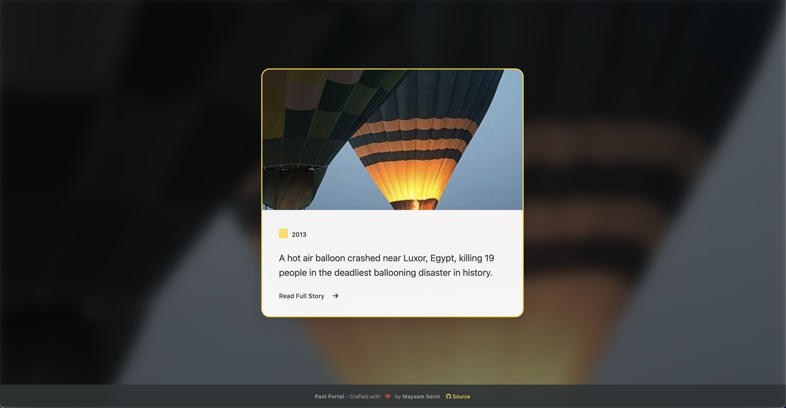

# Past Portal

**A Beautiful New Tab Experience with Historical Events**

[](https://chrome.google.com/webstore/detail/past-portal/your-extension-id)

Discover captivating historical events with beautiful visuals every time you open a new tab. Powered by Wikipedia's "On This Day" API.



### For Users

1. Install from [Chrome Web Store](https://chrome.google.com/webstore/detail/pastportal/your-extension-id)
2. Open a new tab to start exploring!

### For Developers

1. Clone repo:
   ```bash
   git clone https://github.com/imay-dev/past-portal.git
   ```
